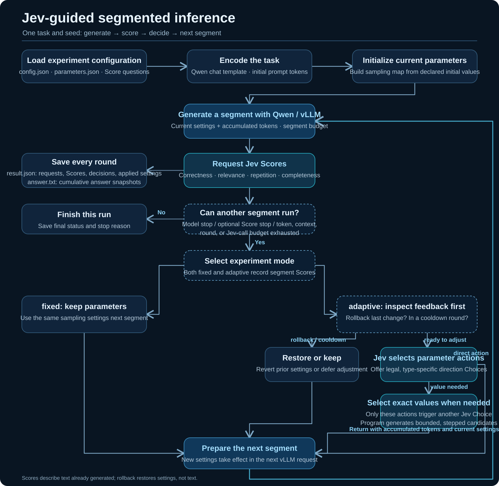

# Jev and vLLM Inference Control

**English** | [简体中文](docs/README.zh-CN.md) | [Project Website](https://jiayicheung.github.io/Jev-for-llm/)

Qwen generates text locally through the Python vLLM API. Jev evaluates each segment using four Score rubrics. A configurable controller chooses the next segment's parameters. The model stays loaded throughout one process. Only Jev uses HTTPS; no local API server is required.



## Contents

- [Environment and installation](#1-environment-and-installation)
- [Layout and ownership](#2-layout-and-ownership)
- [File formats and configuration](#3-file-formats-and-configuration)
- [Run modes](#4-run-modes)
- [First run and results](#5-first-run-and-results)
- [Interpretation limits](#6-interpretation-limits-and-further-reading)

## 1. Environment and installation

### 1.1 Create an isolated environment and obtain the repository

Install Git, Conda and a suitable NVIDIA driver first. Run in a terminal from the parent directory where you want the checkout:

```shell
conda create -n jev-vllm python=3.12 -y
conda activate jev-vllm
python -m pip install --upgrade pip
git clone https://github.com/JiayiCheung/Jev-for-llm.git
cd Jev-for-llm
```

All commands below run from this repository root, where `run.py` is located. Update the paths in section 1.4 before running the project. If you already have a working vLLM environment, activate it and skip dependency reinstallation.

### 1.2 Install the GPU inference backend

This project does not bundle model weights or install vLLM through its package metadata. On Windows, use the [Windows community build instructions](https://github.com/SystemPanic/vllm-windows#installing-an-existing-release-wheel), select a [release wheel](https://github.com/SystemPanic/vllm-windows/releases) matching its stated Python, PyTorch and CUDA requirements, and download it. Then replace the example filename with the actual downloaded file:

```powershell
python -m pip install "C:/Downloads/ACTUAL_RELEASE_WHEEL.whl"
```

The filename is a placeholder, not a release artifact. There is no single wheel command suitable for every Windows environment. The project was exercised with Python 3.12 and a Windows vLLM 0.29.0 build; a fresh installation must be checked independently.

Verify the selected interpreter and GPU visibility:

```powershell
python -c "import sys, torch, vllm; print(sys.executable); print(vllm.__version__); print(torch.__version__); print(torch.version.cuda); print(torch.cuda.is_available())"
```

The last line should be `True`. This checks GPU visibility, not successful model inference.

### 1.3 Install this project and download model files

```shell
python -m pip install -e .
python -m pip install huggingface_hub
hf download Qwen/Qwen3-0.6B --local-dir models/Qwen3-0.6B
```

The [Hugging Face CLI](https://huggingface.co/docs/huggingface_hub/guides/cli) downloads weights, tokenizer and configuration files. If a complete local model already exists, skip the download and use that directory. Editable installation makes the package importable; `run.py` also supports execution directly from the checkout.

### 1.4 Configure the local paths and evaluator

Edit the existing `paths` object in `config.json` to use your machine. This fragment assumes the download command above:

```json
"paths": {
  "model": "models/Qwen3-0.6B",
  "dataset": "data/tasks.jsonl",
  "outputs": "outputs"
}
```

Activate your environment before running, or explicitly use its Python executable. Keep the other configuration sections and fill `jev.api_key` directly; no separate credential input is required.

## 2. Layout and ownership

```text
Jev-for-llm/
  run.py                 Command-line entry point
  config.json            Paths, engine, budgets, API key and policy thresholds
  parameters.json        Selected native fields, types, defaults and actions
  jev_questions.json     Four evaluator rubrics
  pyproject.toml         Package/build metadata
  data/                  Active tasks and sampling provenance
  src/jev_vllm/          Implementation
  outputs/               Generated experiment records
  README.md              Project guide
```

## 3. File formats and configuration

| Section in config.json | Controls |
|---|---|
| paths | Model, dataset, output directory |
| engine | LLM constructor: dtype, context size, sequence capacity, GPU memory fraction, eager execution, tensor parallelism |
| runtime | Optional FlashInfer sampler switch |
| jev | HTTPS base URL, endpoint, model, direct API key, timeout, rubric file |
| generation | Thinking template, segment/total token budgets, round cap |
| parameters_file | Path to the selected parameter definitions |
| experiment | fixed/adaptive mode, seeds, per-experiment Jev call cap |
| policy | cooldown, stopping thresholds, rollback threshold, utility weights |

The project always uses the active Python interpreter and native vLLM. `engine` settings apply when constructing the model; selected SamplingParams apply to the next generation call.

### API key: configuration only

Within the existing `jev` object, set:

```json
"api_key": "YOUR_TYPESAFE_API_KEY"
```

The client reads this field directly. There is no environment-variable lookup or interactive key prompt. Keep the real key in your local configuration; replace it with a placeholder before publishing that file. Saved experiment configuration redacts `api_key`.

The endpoint is `https://api.typesafe.ai/v1/systemone`, with Bearer authentication. See [TypeSafe's API quickstart](https://docs.typesafe.ai/introduction/quickstart). No TypeSafe SDK installation is required: this implementation uses Python's standard-library HTTP client.

### Selecting generation parameters

`parameters.json` is a list of definitions. Example entry:

```json
{
  "name": "temperature",
  "api_name": "temperature",
  "stage": "completion",
  "type": "number",
  "initial": 0.6,
  "minimum": 0,
  "maximum": 2,
  "description": "Sampling randomness",
  "control": {"window": [0, 2], "denominator": 20}
}
```

`parameters.json` sets each parameter's initial value and allowed adjustments. Jev selects type-appropriate changes between generation segments; the next segment uses the updated values. For supported types, field rules, and examples, see the [parameter guide](docs/parameter_examples.md) and [example JSON](docs/parameter_examples.json).

For the broader vLLM design space, see the [1,181-entry checklist taxonomy](docs/vllm_catalog_taxonomy.md) and its [row-by-row CSV](docs/vllm_catalog_taxonomy.csv). This inventory separates current Python controls from other routes and does not certify runtime support.

### Evaluation rubrics and task data

`jev_questions.json` defines correctness, relevance, repetition and completeness. Each uses `type: score`, English `instructions`, and an ordered `criteria` list. The current five levels correspond to 0–4. Parsing validates score and probability distribution; normalization divides score by 4. High repetition is undesirable; the other dimensions reward higher scores.

Tasks belong in `data/tasks.jsonl`, not in the rubric file. JSONL is strict JSON: one complete object per line, no comments or outer array:

```jsonl
{"id":"example_001","prompt":"Solve 2x + 3 = 11.","reference_answer":"4"}
```

Unique nonempty `id` and `prompt` are required. Reference fields are optional metadata and are not sent to Qwen/Jev. The included sample contains ten original English GSM8K **training** questions sampled without replacement using seed 42; provenance is in `data/gsm8k_sample_manifest.json`. It is not a full held-out benchmark. No automatic reference-answer grader is implemented.

## 4. Run modes

Run these commands yourself from the directory containing `run.py`:

| Command | Effect | Loads GPU model | Calls Jev |
|---|---|---|---|
| `python run.py check` | Validate configuration and task loading | No | No |
| `python run.py preview` | Print illustrative Score/direction/value JSON | No | No |
| `python run.py doctor` | Construct native SamplingParams | No | No |
| `python run.py smoke` | Generate eight tokens for the first task | Yes | No |
| `python run.py run` | Run the configured fixed/adaptive mode | Yes | Yes |
| `python run.py compare` | Run fixed then adaptive for each task/seed | Yes | Yes |
| `python run.py summarize` | List saved experiment summaries | No | No |

An alternate configuration is selected with `python run.py run --config "E:\Experiments\config.json"`; copy its referenced files or update their paths too.

For an adaptive experiment set `experiment.mode` to `adaptive`; for a fixed experiment set it to `fixed`. `compare` chooses both automatically and disables score-based early stopping in both. Both groups still call Jev. A continuous, no-Jev baseline is not implemented.

For each task and seed, fixed mode uses at most one Jev Score request per round; adaptive uses at most three requests (Score, direction Choice, exact-value Choice). Each run is also capped by `max_jev_calls`. With 10 tasks, one seed and eight rounds, fixed ≤80 requests, adaptive ≤240, compare ≤320. Model stopping or choosing keep reduces the actual count.

### Command recipes

Run each command from the repository root with the environment active. Checks do not start an experiment automatically.

**check — validate configuration and task input**

```shell
python run.py check
```

Expected console output begins with `Configuration valid; tasks=...; backend=python; mode=...`. It reads the configuration, parameter definitions, rubrics and task file. It does not load the model, authenticate the key or spend Jev credits.

**preview — inspect the three Jev JSON request shapes offline**

```shell
python run.py preview
```

This prints illustrative Score, direction Choice, and exact-value Choice payloads. It does not load Qwen or call Jev.

**doctor — validate the native parameter interface**

```shell
python run.py doctor
```

Expected output: `Native SamplingParams validated. No model loaded and no Jev call made.` It imports vLLM and constructs SamplingParams with the selected values, but does not verify GPU inference or all possible future parameter combinations.

**smoke — one short local generation**

```shell
python run.py smoke
```

This loads Qwen and generates at most eight tokens for the first task, printing response JSON to the terminal. It makes no Jev request and does not create the normal experiment result folder. A short fragment is expected; this is not an answer-quality test.

**run — one configured experiment mode**

```shell
python run.py run
```

This runs every task and seed using `experiment.mode`, makes Jev calls, and creates a result folder for each task/seed. Use one of the fixed/adaptive recipes below.

**compare — two modes per task and seed**

```shell
python run.py compare
```

The command overrides the configured mode, runs fixed then adaptive for each task/seed, and turns off score-based stopping in both. It produces separate result folders, not a statistical comparison report. Both groups call Jev; inference and evaluator costs can therefore roughly double relative to one mode, subject to actual stopping.

**summarize — inspect existing records**

```shell
python run.py summarize
```

Prints one JSON summary per result: task, seed, mode, status, stop reason, generated-token count, Jev-call count, elapsed seconds and file path. It makes no API/model call. It still loads the current configuration and tasks, so those files must remain valid. It searches immediate result subdirectories of the configured outputs directory; it does not grade answers.

## 5. First run and results

1. Edit paths, direct API key and input tasks.
2. Run `check`, then `doctor`, then `smoke`.
3. Choose **one** of `run` and `compare` according to the experiment goal.
4. Run `summarize` and inspect the saved records.

From a configured checkout, a single-mode run is:

```powershell
conda activate jev-vllm
cd Jev-for-llm
python run.py run
```

For the two-group experiment, replace the last command with `python run.py compare`. No credential setup outside `config.json` is needed. `check` does not authenticate the API key; `doctor` validates parameter construction but does not prove the model or every parameter combination will run.

Each task/seed/mode creates `outputs/<timestamp>_<mode>/result.json` and `answer.txt`. `answer.txt` contains a labeled cumulative-answer snapshot after every generated round; the last snapshot is the final full answer. `result.json` also keeps each round's `answer_snapshot`. Inspect `rounds[].scores`, `decision`, `applied_parameters`, `generation_request`, timing and stop reason. A proposed adjustment is only confirmed by the next round's actual request. `decision_will_execute` alone does not prove the next call succeeded.

Normal completion means the loop ended, not that the answer is correct. Stopping may be caused by the model, token/context/round/call budgets, or enabled score stopping. Ctrl+C normally records interruption; forced process termination can leave `status: running`. Partial records remain. Rerunning starts over; there is no resume or automatic paid retry. An exception stops the remaining experiment loop.

For a local log (after the key is configured):

```powershell
New-Item -ItemType Directory -Force outputs | Out-Null
python run.py compare 2>&1 | Tee-Object -FilePath outputs/compare.log
```

This PowerShell example saves a console log inside the configured checkout. Logs may contain task/model output. Results, not only console messages, are the experiment record.

## 6. Interpretation limits and further reading

Each segment is a separate generate call; earlier tokens become prompt context. Presence/frequency penalties apply to newly generated tokens within that call, while repetition penalty also considers prompt tokens. Stop matching across segment boundaries is not guaranteed. Parameters change between calls, not during an active call. Prefix caching may help but does not make segmented generation identical to continuous generation.

Jev and each `answer.txt` snapshot use cumulative raw decoding, potentially including special tokens and stop content; display options affect native display text. Seed is incremented by segment index. Fixed/adaptive comparisons share starting values and budgets, but that does not guarantee identical random trajectories or improved accuracy.

See [implementation notes](docs/implementation.md) and the [GSM8K source](https://github.com/openai/grade-school-math). Use an independent answer grader before making benchmark accuracy claims.
