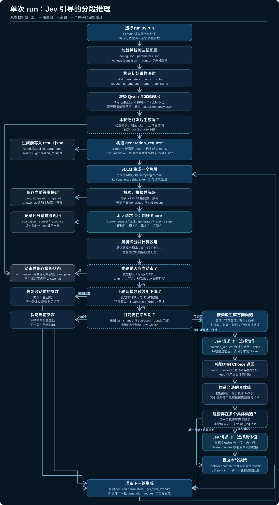

# Jev 与 vLLM 推理控制

[English](../README.md) | **简体中文** | [项目主页](https://jiayicheung.github.io/Jev-for-llm/)

Qwen 通过 **Python vLLM 接口在本地生成**；Jev 用 Score 评价每段输出里的症状；参数决策模块据此决定下一段使用的参数。一个进程内保持模型加载，只有 Jev 调用使用 HTTPS，**不需要启动本地 HTTP 服务**。



## 目录

- [1. 环境与安装](#1-环境与安装)
- [2. 目录与文件职责](#2-目录与文件职责)
- [3. 文件格式与配置](#3-文件格式与配置)
- [4. 运行方式](#4-运行方式)
- [5. 首次运行与结果解读](#5-首次运行与结果解读)
- [6. 实验边界与延伸阅读](#6-实验边界与延伸阅读)

## 1. 环境与安装

### 1.1 创建独立环境并获取仓库

先安装 Git、Conda 和适合显卡的 NVIDIA 驱动。在希望存放仓库的父目录打开终端：

```shell
conda create -n jev-vllm python=3.12 -y
conda activate jev-vllm
python -m pip install --upgrade pip
git clone https://github.com/JiayiCheung/Jev-for-llm.git
cd Jev-for-llm
```

后续命令均在包含 `run.py` 的仓库根目录执行。运行前按 1.4 节修改配置路径。已有可用 vLLM 环境的读者可直接激活原环境，跳过依赖重装。

### 1.2 安装 GPU 推理后端

本仓库不包含模型权重，其包元数据也不会自动安装 vLLM。在 Windows 上，阅读 [Windows 社区安装说明](https://github.com/SystemPanic/vllm-windows#installing-an-existing-release-wheel)，从[发布页](https://github.com/SystemPanic/vllm-windows/releases)下载与其声明的 Python、PyTorch、CUDA 要求匹配的 wheel，然后将下面文件名替换为实际下载文件：

```powershell
python -m pip install "C:/Downloads/ACTUAL_RELEASE_WHEEL.whl"
```

上述文件名是占位符，不是真实发布文件，不存在适合所有 Windows 环境的一条固定 wheel 命令。本实现曾使用 Python 3.12、Windows vLLM 0.29.0 构建验证，新环境仍需独立检查。

安装后检查解释器与 GPU：

```powershell
python -c "import sys, torch, vllm; print(sys.executable); print(vllm.__version__); print(torch.__version__); print(torch.version.cuda); print(torch.cuda.is_available())"
```

最后一行应为 `True`。这只证明 GPU 可见，不等于模型推理已经验证成功。

### 1.3 安装项目并下载模型

```shell
python -m pip install -e .
python -m pip install huggingface_hub
hf download Qwen/Qwen3-0.6B --local-dir models/Qwen3-0.6B
```

[Hugging Face CLI](https://huggingface.co/docs/huggingface_hub/guides/cli) 下载权重、分词器和配置。已有完整模型目录可跳过下载，直接配置路径。可编辑安装使包可导入，`run.py` 也支持直接从仓库运行。

### 1.4 修改本机路径和评价器配置

编辑 `config.json` 中已有的 `paths` 对象。按上面命令下载模型后，可使用以下片段：

```json
"paths": {
  "model": "models/Qwen3-0.6B",
  "dataset": "data/tasks.jsonl",
  "outputs": "outputs"
}
```

运行前激活环境，或显式使用对应的 Python 可执行文件。保留配置中的其他对象，并填写本地 `jev.api_key`，或在进程环境中设置 `TYPESAFE_API_KEY`。

## 2. 目录与文件职责

```text
Jev-for-llm/
  run.py                 命令行入口
  config.json            路径、引擎、API 密钥和决策设置
  parameters.json        选中的原生参数、类型、初值和调整规则
  jev_questions.json     评分维度（症状评分与 on_track 预测）的英文指令与等级标准
  pyproject.toml         Python 包元数据与 black / isort 设置
  data/                  当前运行题目与抽样来源记录
  src/jev_vllm/          核心实现
  scripts/               离线分析与仪表盘生成脚本
  tests/                 单元测试（python -m pytest tests）
  outputs/               实验输出
  README.md              项目说明
```

代码风格：使用 [black](https://black.readthedocs.io/) 和 [isort](https://pycqa.github.io/isort/)（设置见 `pyproject.toml`），用 `flake8`（使用本地未入库的 `.flake8`）检查。提交前运行 `python -m black . && python -m isort . && python -m flake8 && python -m pytest tests`。

## 3. 文件格式与配置

| config.json 配置项 | 控制内容 |
|---|---|
| paths | 模型、题目文件、输出目录 |
| engine | LLM 构造参数：精度、上下文长度、序列容量、显存比例、eager 模式、张量并行 |
| runtime | 可选 FlashInfer 采样开关 |
| jev | HTTPS 地址、接口路径、模型、直接密钥、超时、评分标准文件、请求文本视图（选择类请求携带多少已生成文字） |
| generation | 思考开关、分段与总 token 预算、轮数上限 |
| parameters_file | 参数定义文件路径 |
| experiment | fixed/adaptive/baseline 模式、随机种子 |
| policy | 从检查点重来（由 Jev 决定是否让一段很长的推理回退重做）、同方向连续上限、空转参数休眠、症状权重、信号设置 |

项目固定使用当前 Python 解释器直接调用 vLLM。`engine` 在创建模型时生效；`parameters.json` 中的 SamplingParams 在下一次生成调用时生效。

### API 密钥直接放入配置

在已有的 `jev` 对象中填写：

```json
"api_key": "YOUR_TYPESAFE_API_KEY"
```

程序优先读取 `jev.api_key`，为空时读取 `TYPESAFE_API_KEY`，不会交互询问密钥。不要把真实密钥发布到仓库；保存到实验结果中的配置会遮蔽 `api_key`。

接口地址为 `https://api.typesafe.ai/v1/systemone`，使用 Bearer 认证。本实现用 Python 标准库发送请求，不需要另装 TypeSafe SDK。参见 [TypeSafe API quickstart](https://docs.typesafe.ai/introduction/quickstart)。

### 参数定义与运行时数值

`parameters.json` 最外层是一个列表，每项定义一个参数。例如：

```json
{
  "name": "temperature",
  "api_name": "temperature",
  "stage": "completion",
  "type": "number",
  "initial": 0.6,
  "minimum": 0.2,
  "maximum": 2,
  "description": "Sampling randomness",
  "control": {"window": [0.2, 2], "denominator": 18}
}
```

`parameters.json` 定义参数初值和允许的调整方式。Jev 按参数类型选择合法改动，更新后的值从下一段生成开始生效。支持的类型、字段规则与填写示例见[参数示例教程](parameter_examples.zh-CN.md)和[示例 JSON](parameter_examples.json)。

更完整的 vLLM 范围见 [1,181 项清单分类](vllm_catalog_taxonomy.zh-CN.md)及其[逐条 CSV](vllm_catalog_taxonomy.csv)。这份清单区分了当前 Python 控制项与其他接口，并不代表所有项目已经通过运行验证。

### Jev 评分标准与输入题目

`jev_questions.json` 定义 Score 维度。每个维度有 `type: score`、`kind`、英文 `instructions` 和有序 `criteria` 列表，五档对应 0–4。`kind` 只由程序读取，**不会发给 Jev**。

| 维度 | 类别 | 评价范围 | 看什么 |
|---|---|---|---|
| `scatter`（散乱） | 症状 | 最新一段 | 像采样噪声造成的失误 |
| `rigidity`（僵住） | 症状 | 最新一段 | 重复自己、原地打转 |
| `distortion`（扭曲） | 症状 | 最新一段 | 乱码、语言切换、怪异格式 |
| `over_checking`（过度复核） | 症状 | 最近 3 段 | 反复核对或重述已不再变化的结果 |
| `under_checking`（复核不足） | 症状 | 最近 3 段 | 没有核对就下结论或换思路 |
| `on_track`（在正轨） | 预测 | 整条推理 | 最终答对的可能性（只给重来检查用） |

症状类 0 表示没有、4 表示严重，所以**越高越糟**；预测类越高越好。评分请求发送 `task`、`segments`（保留下来的各段，组成一个列表，最新的在最后，**任何文字都不会出现两遍**）和一句 `about` 说明；每个维度的指令说明它评价 `segments` 里的哪几项。

程序对每个症状计算 `severity`（期望等级 ÷ 最高等级）和 `p_severe`（最高两档的概率之和）。`trouble` 是各症状加权后的**最大严重度**（`policy.symptom_weights`，按最大权重归一化为 1），`worst` 指出是哪一项。Jev 选参数时看到这些值，加上第 1 段的值（`at_start`）、最近 3 段、每个症状连续出现的段数（`policy.signals.persistence_threshold`）、自己最近改了哪些参数以及每个改动已生效几段，还有一段只解释字段含义的 `reading_guide`。请求里**没有任何一句告诉 Jev 遇到某个症状该怎么办**，每个参数的说明只写机制、范围和中性值。`trouble` 只用于展示和记录，没有任何程序规则依据它行动。

模型要解答的题目在 `data/tasks.jsonl`，**不在评分标准文件里**。JSONL 每行是一个完整的严格 JSON 对象，不支持注释，也没有外围数组：

```jsonl
{"id":"example_001","prompt":"Solve 2x + 3 = 11.","reference_answer":"4"}
```

`id` 必须是唯一非空字符串，`prompt` 必须是非空字符串。参考答案是可选元数据，不发送给 Qwen/Jev。仓库附带的题目是 GSM8K **测试集**英文原题，使用随机种子 42 无放回抽取 400 道（`python scripts/prepare_gsm8k.py --split test --count 400 --seed 42`，加 `--download` 会把原始文件下载到被 git 忽略的 `data/raw/`）。抽样记录和源文件的 SHA256 在 `data/gsm8k_sample_manifest.json`；`data/tasks_train10.jsonl` 保留了之前的 10 道训练集题，用于快速冒烟测试。答案由 `scripts/analyze_results.py` 离线判分（对显式最终答案做数值精确比对），生成过程中不使用判分器。

## 4. 运行方式

在包含 `run.py` 的目录中由使用者自行执行：

| 命令 | 用途 | 加载 GPU 模型 | 调用 Jev |
|---|---|---|---|
| `python run.py check` | 检查配置和题目加载 | 否 | 否 |
| `python run.py preview` | 打印三阶段示例 JSON，检查 Jev 输入形状 | 否 | 否 |
| `python run.py doctor` | 构造原生 SamplingParams 校验 | 否 | 否 |
| `python run.py smoke` | 第一题实际生成 8 个 token | 是 | 否 |
| `python run.py run` | 运行配置指定的 fixed 或 adaptive | 是 | 是 |
| `python run.py run --mode baseline` | 保持初始参数生成，不调用 Jev | 是 | 否 |
| `python run.py compare` | 每题/种子先 fixed 再 adaptive | 是 | 是 |
| `python run.py dashboard` | 打开实验结果的交互式可视化仪表盘 | 否 | 否 |
| `python run.py summarize` | 列出保存的实验摘要 | 否 | 否 |

使用另一份配置：

```powershell
python run.py run --config "E:\Experiments\config.json"
```

同时应复制它引用的文件，或修改引用路径。`run` 根据 `experiment.mode` 选择模式；`compare` 自动跑两种模式。**fixed 组仍调用 Jev 记录评分，只是不根据评分调整参数**。`run --mode baseline` 可另跑不调用 Jev 的基线；如何与 adaptive 批次严格配对见[结果分析](analysis.md)。

Jev 请求数上限为：

```text
没有请求数上限：每个运行在模型自己停止或上下文窗口写满时结束，请求数随模型推理的长度增长
```

fixed 每轮最多 1 次 Score；adaptive 每轮最多 1 次 Score、1 次方向 Choice、1 次具体值 Choice。模型停止、所有参数保持等情况会减少请求。

### 七个命令分别怎么用

先激活环境，再在仓库根目录运行。执行检查不会自动启动实验。

**check：检查配置与题目**

```shell
python run.py check
```

预期输出以 `Configuration valid; tasks=...; backend=python; mode=...` 开头。它读取主配置、参数定义、评分标准和题目，不加载模型，不验证密钥认证，也不消耗 Jev 额度。

**preview：离线查看三阶段 Jev JSON**

```shell
python run.py preview
```

使用第一道题和示例评分打印 Score、方向 Choice、具体值 Choice 的 JSON；不加载 Qwen，也不调用 Jev。

**doctor：校验原生参数接口**

```shell
python run.py doctor
```

预期输出为 `Native SamplingParams validated. No model loaded and no Jev call made.`。它导入 vLLM 并用选定值构造 SamplingParams，不执行 GPU 推理，也不能证明后续所有参数组合都可用。

**smoke：短小的本地生成检查**

```shell
python run.py smoke
```

加载 Qwen，对第一题生成最多 8 个 token，在终端打印响应 JSON。不调用 Jev，也不创建正常实验结果目录。只得到短片段是正常情况，这不是答案质量测试。

**run：运行配置中的一种模式**

```shell
python run.py run
```

按照 `experiment.mode` 遍历全部题目和种子，调用 Jev，并为每个题目/种子保存结果目录。下面提供 fixed 和 adaptive 两种配置例子。

**compare：每题每种子运行两组**

```shell
python run.py compare
```

命令覆盖配置中的模式，每个题目/种子先 fixed 再 adaptive，两组都关闭评分触发的停止。它生成独立结果目录，不生成统计比较报告。两组都调用 Jev；adaptive 每轮还可能增加两次 Choice 请求，因此开销要按实际请求数和生成长度核算。

**summarize：读取已有结果**

```shell
python run.py summarize
```

每个结果输出一条 JSON 摘要，包括题目、种子、模式、状态、停止原因、生成 token 数、Jev 调用数、耗时和路径。不调用模型或 API，但仍会加载当前配置和题目，因此这些文件需保持有效。只查找 outputs 直接子目录内的结果，不执行答案判分。

**dashboard：可视化实验结果**

```shell
python run.py dashboard
```

打开已保存实验结果的交互式可视化仪表盘。

## 5. 首次运行与结果解读

1. 修改路径和题目文件，并提供本地 `jev.api_key` 或 `TYPESAFE_API_KEY`。
2. 依次执行 `check`、`doctor`、`smoke`。
3. 根据实验目标选择 **run 或 compare 其中一个**。
4. 执行 `summarize` 并查看保存记录。

配置好仓库与密钥后，单模式实验执行：

```powershell
conda activate jev-vllm
cd Jev-for-llm
python run.py run
```

如果要跑两组对照，将最后一条换成 `python run.py compare` 即可。`check` 不会验证 API 密钥是否能通过认证；`doctor` 只验证参数构造，不能证明模型和所有参数组合实际运行成功。

每个题目/种子/模式生成一个 `outputs/<timestamp>_<mode>/`，包含 `result.json` 和 `answer.txt`。`answer.txt` 按轮次列出每轮结束时的**累计答案快照**；最后一段就是最终完整答案。`result.json` 的每轮还保留 `answer_snapshot`。重点查看每轮 `rounds[]` 的 `scores`、`decision`、`applied_parameters`、`generation_request`、耗时以及最终停止原因。

决策只是对下一段的提议，**下一轮实际请求才证明新参数被使用**。`decision_will_execute` 也不能单独证明下一次调用已成功。

`completed` 表示循环正常结束，不代表答案正确。结束源于模型自己停止或上下文窗口写满（`stop_reason` 为 `model_stop` 或 `context_budget`）。Ctrl+C 通常会保存 interrupted 状态；强制结束进程可能留下 running 状态。程序保留部分记录。中断后用相同配置和批次 ID 执行 `python run.py compare --experiment-id 批次ID --resume`，已完成的题目/种子/模式会跳过；中断的运行从第一段重新开始，不会接续未完成的段。Jev 临时 HTTP 5xx 错误最多额外重试两次，仍失败就停止后续实验。

配置好密钥后，可将控制台输出存到本地已有日志目录：

```powershell
New-Item -ItemType Directory -Force outputs | Out-Null
python run.py compare 2>&1 | Tee-Object -FilePath outputs/compare.log
```

此 PowerShell 示例将控制台日志保存在仓库的 outputs 目录。日志可能含题目和生成内容，完整实验依据应以保存结果为准。

## 6. 实验边界与延伸阅读

每段都是独立的 generate 调用，历史 token 作为下一段提示词。presence/frequency penalty 的计数针对本次调用新生成 token；repetition penalty 还考虑提示词。跨片段的停止字符串匹配不作保证。参数在调用之间改变，不是在正在执行的生成内部热修改。前缀缓存可能减少重复计算，但不会使分段生成等同于一次连续生成。

Jev 和 `answer.txt` 的各轮快照使用累积 token 的原始解码，可能保留特殊 token 和停止内容；显示参数作用于原生显示文本。每段使用 `seed + step`。fixed/adaptive 共享初始值和预算，不保证随机轨迹相同，也不保证准确率提高。

更多信息见[实现说明](implementation.zh-CN.md)和 [GSM8K 来源](https://github.com/openai/grade-school-math)。报告 benchmark 正确率前，应增加独立的答案判分器。
